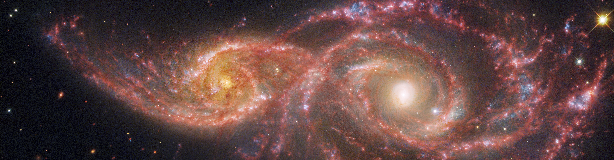

  

<h1 align="center">Hi 👋, I'm Andy</h1>

<h3 align="center">
Astrophysics • Machine Learning • Scientific Computing
</h3>

 

<h3 align="center">Current work</h3>

Creating synthetic spectral datasets for telluric correction using Telfit and PHOENIX.

 

📫 <b>astroandygsr@gmail.com</b>

 

<h3 align="center">Connect with me</h3>

